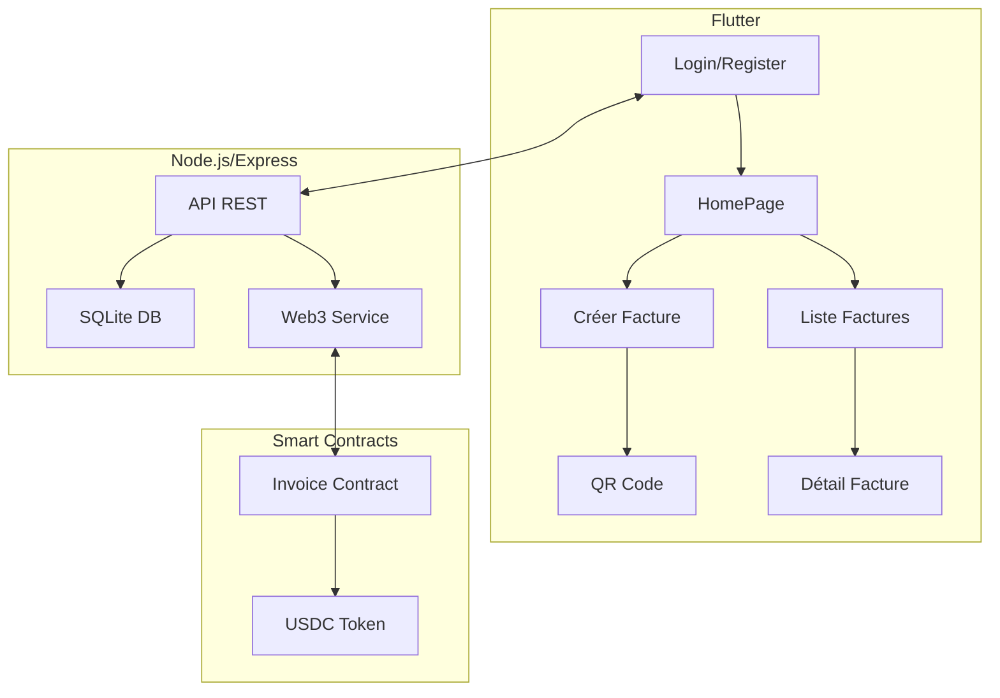

# Facture USDC – Application Flutter &## Fonctionnalités principales
- Authentificatio### 1. Backend Node.js
```bash
cd- Modifiez l| POS| POST    | /api/invoices | Cré- Stockez la clé privée dans `.env` (jamais dans le code)
- Utilisez HTTPS en production
- Testez d'abord sur testnet (Sepolia, Mumbai, etc.)
- Vérifiez les allowances USDC avant les paiements
- Validez les adresses et montants côté contrate facture (on-chain) |
| GET     | /api/invoices/:id | Détail d'une facture |
| PUT     | /api/invoices/:id | Modifie une facture |
| DELETE  | /api/invoices/:id | Supprime une facture |
| POST    | /api/contract/create | Crée une facture sur le smart contract |
| GET     | /api/contract/status/:id | Vérifie le statut de paiement on-chain | /api/invoices | Crée une facture (on-chain) |
| GET     | /api/invoices/:id | Détail d'une facture |
| PUT     | /api/invoices/:id | Modifie une facture |
| DELETE  | /api/invoices/:id | Supprime une facture |
| POST    | /api/contract/create | Crée une facture sur le smart contract |
| GET     | /api/contract/status/:id | Vérifie le statut de paiement on-chain |PI dans `main.dart` si besoin (pour mobile, utilisez l'IP du backend)
- Assurez-vous d'avoir un wallet connecté (MetaMask, etc.) pour les paiements blockchainlib/ApiBdd
npm install
# Créez un fichier .env avec :
# RPC_URL=https://rpc.ankr.com/eth (ou votre RPC)
# PRIVATE_KEY=VOTRE_CLE_PRIVEE_DEPLOIEMENT
# CONTRACT_ADDRESS=ADRESSE_DU_CONTRAT_DEPLOYE
node app.js
```
- Serveur sur `http://localhost:3000`
- Variables d'environnement :
  - `RPC_URL` (RPC Ethereum/Polygon pour interagir avec les contrats)
  - `PRIVATE_KEY` (clé privée pour les transactions, optionnel si lecture seule)
  - `CONTRACT_ADDRESS` (adresse du contrat Invoice déployé)
  - `PORT` (optionnel, défaut 3000)(JWT, API Node.js, SQLite)
- Création, visualisation et gestion de factures USDC via smart contracts
- Génération de QR code pour paiement crypto
- Paiement direct via smart contracts (approve/transferFrom USDC)
- Interface web/mobile responsive avec UX professionnelle
- Gestion on-chain des factures (création, paiement, statut)ontracts

<p align="center">
  <br><br>
  
  
  
  
</p>

---

**Facture USDC** est une solution complète pour commerçants permettant de générer, visualiser et gérer des factures USDC via des smart contracts, avec gestion d'utilisateurs, QR code, stockage sécurisé et UX professionnelle. – Application Flutter & API Node.js (Circle CCTP)

<p align="center">
  
  <br><br>
  
  
  
  
</p>

---

**Facture USDC** est une solution complète pour commerçants permettant de générer, visualiser et envoyer des factures USDC multichain, avec gestion d’utilisateurs, QR code, stockage sécurisé, UX professionnelle, et intégration Circle (CCTP, gasless à venir).

---

## Aperçu visuel

<p align="center">
  
  
</p>

---

## Fonctionnalités principales
- Authentification sécurisée (JWT, API Node.js, SQLite)
- Création, visualisation et envoi de factures USDC (mobile/web)
- Génération de QR code pour paiement crypto
- Envoi de factures par email
- Intégration Circle CCTP (transfert cross-chain USDC, monitoring, unsignedVaas)
- Prêt pour l’intégration gasless (Circle Paymaster)
- Responsive, UX pro, navigation fluide

---

## Architecture



---

## Installation & Lancement

### 1. Backend Node.js
```bash
cd lib/ApiBdd
npm install
# Créez un fichier .env avec :
# CIRCLE_API_KEY=VOTRE_CLE_SANDBOX
node app.js
```
- Serveur sur `http://localhost:3000`
- Variables d’environnement :
  - `CIRCLE_API_KEY` (obligatoire pour Circle CCTP)
  - `PORT` (optionnel, défaut 3000)

### 2. Frontend Flutter
```bash
flutter pub get
flutter run -d chrome # ou -d ios/android selon la plateforme
```
- Modifiez l’URL API dans `main.dart` si besoin (pour mobile, utilisez l’IP du backend)

---

## API REST principale

| Méthode | Endpoint | Description |
|---------|----------|-------------|
| POST    | /api/register | Crée un utilisateur |
| POST    | /api/login    | Authentifie et retourne un JWT |
| GET     | /api/invoices?user_email=... | Liste les factures |
| POST    | /api/invoices | Crée une facture |
| GET     | /api/invoices/:id | Détail d’une facture |
| PUT     | /api/invoices/:id | Modifie une facture |
| DELETE  | /api/invoices/:id | Supprime une facture |
| POST    | /api/cctp | Crée un message CCTP (Circle) |
| GET     | /api/cctp/:messageId | Statut du transfert CCTP |

---

## Smart Contracts
- Voir `/contract/Invoice.sol` pour le contrat principal de gestion des factures USDC
- Voir `/contract/deploy/` pour les scripts de déploiement
- Le contrat gère la création, le paiement et le suivi des factures on-chain
- Utilise l'interface ERC20 pour les transferts USDC

---

## Structure du dossier `contract/`
- `Invoice.sol` : smart contract principal de facturation USDC
- `web3_service.js` : service Node.js pour interagir avec les contrats
- `deploy/` : scripts de déploiement des contrats (Hardhat/Truffle)
- `test/` : tests unitaires des contrats

---

## Sécurité & bonnes pratiques
- Stockez la clé API Circle dans `.env` (jamais dans le code)
- Utilisez HTTPS en production
- Testez d’abord en sandbox
- Protégez toutes les routes sensibles par JWT

---

## Roadmap / TODO
- Interface de connexion wallet (MetaMask, WalletConnect)
- Export PDF/partage QR code
- Support multi-chain (Ethereum, Polygon, Arbitrum)
- UI/UX avancée (dark mode, notifications…)
- Déploiement cloud (Heroku, Vercel, etc.)

---

## Liens utiles
- [Documentation Solidity](https://docs.soliditylang.org/)
- [OpenZeppelin Contracts](https://docs.openzeppelin.com/contracts/)
- [Flutter](https://flutter.dev/)
- [Node.js](https://nodejs.org/)

---

**Licence MIT**

---

> Pour toute question ou contribution, ouvrez une issue ou une pull request sur ce repo !
